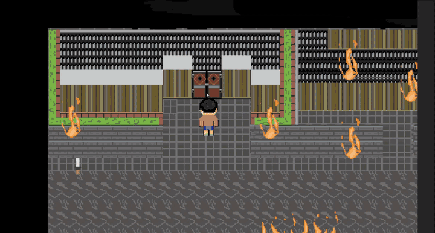
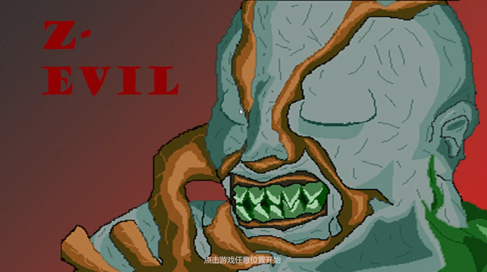
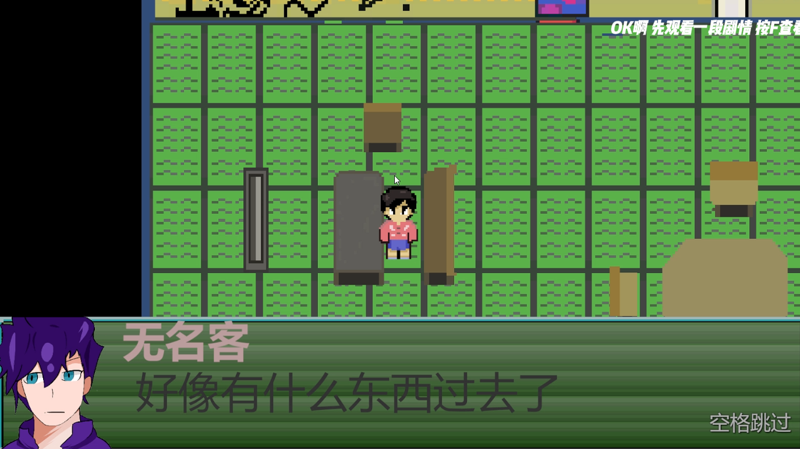
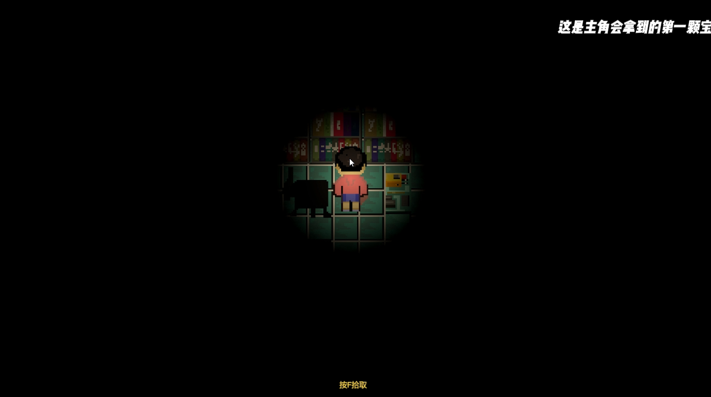
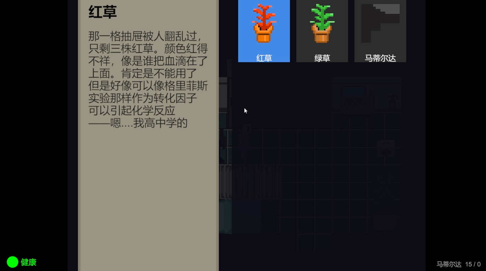

# Z-Evil

> **Vibe Coding 之作** —— 设计与调试由我主导，代码实现与 AI 深度协作

> 一款 2D 像素生存恐怖游戏：一名医生在休息日遭遇丧尸狗破窗而入，为取回留在医院的半辈子医学成果，逆着逃散的人流回到已经沦陷的医院。

▶ [**90 秒快速演示（B站）**](https://www.bilibili.com/video/BV1TWaq6NEjd) ｜ ▶ [完整演示 6 分钟（B站）](https://www.bilibili.com/video/BV1P8aq6cETL)

## 项目简介

《Z-Evil》是一款对标经典生存恐怖的 2D 像素游戏（探索、解谜、资源管理、被追杀）。玩家在资源匮乏与信息不足中持续做选择：弹药、药品、视野都是稀缺品，而"看不清"本身就是最大的威胁。项目目标是把"生存恐怖"四个字做扎实，并完整走通从策划、程序到打包发布的全流程。

- **引擎**：Unity 2022.3.62f3c1（URP 2D）
- **语言**：C#
- **开发人数**：1 人（独立开发）
- **开发周期**：约 6 周（Git 提交记录 2026.08.02 – 2026.09.13，共 19 次提交）

## 核心功能

- **3 个关卡 + 传送门串联的房间式地图**（住宅 → 医院 → 地下室），5 类门禁：钥匙锁 / 机关锁 / 3 宝石镶嵌门 / 卡住的门 / 双文字提示
- **完整敌人 AI 追击系统**：6 种敌人（丧尸 / 丧尸狗 / 乌鸦群 / 舔食者 / 电锯哥 / 暴君），网格四方向贪心寻路 + 卡住诊断 + 牵引圈
- **武器系统**（手枪 / 霰弹枪 / 沙鹰 / 小刀）：弹夹换弹、5 弹丸散射、穿透与穿透伤害衰减、近战耐久 —— **全部用 ScriptableObject 数据表配置**
- **解谜与机关系统**：11 种谜题（照片密码 / 红灯计数 / 推箱子 + 压力板 + 60 秒倒计时 / 过敏名单拖线 / 宝石铁门 / 密码箱 ……），答案都藏在场景环境里
- **存档 / 背包 / 门锁**：单档位存档 + 世界进度表（精确还原到存档那一刻）、背包 + 草药合成、纸条收集（TAB → Q）
- **剧情与演出**：对话板 + 踩点剧情触发器 + 纸条 / 日记面板 + 开场演出与结局演出（10 罐齐闪红 → 电影式硬切 → 两幕标题 → 滚动落幕 → 点击退出）
- **恐怖氛围系统**：蜡烛黑夜照明（URP 2D Light）+ 两段式距离听声（12 格内全音量 / 12~16 渐变 / 16 格外静音）+ 2D 音量圈

## 我自己实现的技术点

- **世界进度表 `WorldState`**：设计"类型\_场景名\_层级路径"作为全局状态键，统一登记门 / 机关 / 怪物死亡状态并整表序列化进存档 —— 用层级路径而非物体名，避免同场景重名物体在存档里互相覆盖
- **单档位存档体系 `SaveSystem`**：用静态 `pendingData` 做跨场景延迟应用（新场景 `Awake` 恢复世界状态、`Update` 首帧恢复玩家血量与背包），规避"调用已销毁实例"；资产引用改存名字、读档时按名字找回
- **统一空间查询工具 `ObstacleQuery`**：终点圆 + 中心射线 + 中点盒三层障碍检测，且全部排除自身 / 子物体碰撞体 —— 解决"大碰撞体自己挡自己"与"薄墙漏检"两类物理查询陷阱
- **怪物 AI 网格寻路与调试**：四方向贪心（严格小于比较防等距抖动）+ 卡住诊断 + 牵引圈；定位并修复了"目标点每帧累加"导致的**穿墙 / 乱飘 / 卡住三症状同根因**的时序缺陷
- **Boss 四相状态机**（`Alive → FakeDeath → Lunging → Dead`）：把通关事件收口到"真死"方法里广播，避免"假死"阶段误触发结局演出；状态写进进度表，读档可区分两种进度
- **`ScriptableObject` 武器数据表 `GunData`**：伤害 / 射速 / 弹夹 / 散射角 / 弹丸数 / 穿透上限与伤害衰减 / 耐久 / 音效全部数据化配置，新增武器无需改代码
- **自定义 Editor 工具 `IdValidator`**：菜单一键扫描全项目的空 ID / 跨场景重复 ID / 纸条缺信息 / 钥匙卡槽未对应 / 枪缺数据等配置错误，发布前自检
- **表现层工具集**：黑屏转场（`渐黑 → 加载 → 等一帧 → 渐亮`，全程 `unscaledDeltaTime`）、距离听声两段式衰减、2D 音量圈（因 Unity 的 `spatialBlend` 无法同时满足"两耳等量"与"按范围衰减"，改用平面距离自算音量 + `Gizmos` 可视化调参）

## 操作说明

| 操作 | 按键 |
|------|------|
| 移动 | `W` `A` `S` `D` / 方向键 |
| 交互（拾取 / 开门 / 查看 / 传送） | `F` |
| 打开背包 | `Tab` |
| 物品操作菜单（使用 / 合成 / 取消） | `空格` |
| 使用宝石 | `E` |
| 纸条列表 | `Q` |
| 开枪 / 挥刀 | `J` |
| 换弹 | `R` |
| 死亡界面：读档重开 | `R` |

## 怎么跑起来

1. 克隆仓库：`git clone https://github.com/dasdsadsadwvb123/Z-Evil-Portfolio.git`
2. 用 Unity Hub 安装 **2022.3.62f3c1**，并用它打开项目
3. 打开 `Assets/Scenes/Intro.unity`
4. 点击 Play

> 首次打开需要等 Unity 导入资源（几分钟）；`Intro` 是开场界面场景，按 Play 后点击画面即可开始。

## 截图

**开场封面**

**开场剧情演出**

**蜡烛照明下的探索（全黑房间靠烛光视物）**

**背包与物品说明**

## 演示视频

- [完整演示（6 分钟）](https://www.bilibili.com/video/BV1P8aq6cETL)
- [高光版（90 秒）](https://www.bilibili.com/video/BV1TWaq6NEjd)

## 后续计划

- 剧情留有续作线索：结局的"未完待续"与贯穿全篇的血字伏笔尚未收完

## 关于我

**陈昊泽** ｜ 求职方向：**游戏开发实习生** ｜ **U3D 客户端（AI 工具向）** ｜ 技术美术

📧 [3174875570@qq.com](mailto:3174875570@qq.com) ｜ GitHub [@dasdsadsadwvb123](https://github.com/dasdsadsadwvb123)
